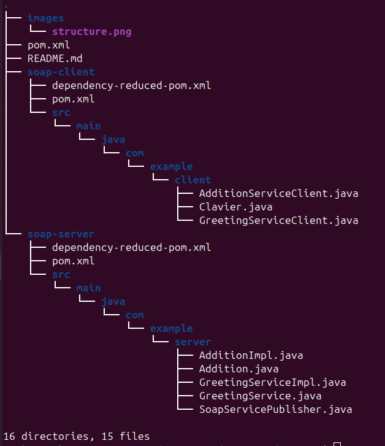

# SOAP Web Services with Java

This project demonstrates how to create a SOAP web service using Java. The project consists of three modules:
## Project Structure

The project is organized as follows:




## Explanation of Each Part

### 1. soap-server
- Sets up a soap service which expose two services:
    - GreetingService : a simple service for testing (a hello word service).
    - AdditionService : a service that takes two integers and returns their sum.

### 2. soap-client
- A simple client that consumes the SOAP services exposed by the server.
- The client uses the JAX-WS API to generate the client code from the WSDL file of the services.
- The client code is generated using the wsimport tool.
- The client code is generated in the com.example.client.greeting and com.example.client.addition packages.
- The client code is used to call the GreetingService and AdditionService.
- The client code is generated in the src/main/java directory.
- The client code is used to call the GreetingService and AdditionService.
## Running the Project

### 1. Compile and Package the Project
Run the following command to build the project:

1. compile the project :
```bash
    mvn clean install
    This will compile the Java classes and create a JAR file in the target directory.
```
2. Run the SOAP server :
```bash
    java -cp soap-server/target/soap-server-1.0-SNAPSHOT.jar com.example.server.SoapServicePublisher
```

## Licence
This project is licensed under the MIT License - see the LICENSE file for details.

## Test your SOAP service using Postman
1. Open Postman
2. Create a new POST request with the URL http://localhost:8080/greeting
3. set the request Header to Content-Type: text/xml
4. set the request Body to the following Body/row/XML:
```xml

<soapenv:Envelope xmlns:soapenv="http://schemas.xmlsoap.org/soap/envelope/" xmlns:ws="http://server.example.com/">
    <soapenv:Header/>
    <soapenv:Body>
        <ws:sayHello>
            <name>John</name>
        </ws:sayHello>
    </soapenv:Body>
</soapenv:Envelope>

```
xmlns:ws="http://server.example.com/" is the namespace of the service you want to call, in this case, the GreetingService.

If the service is correctly implemented, you should receive a SOAP response like this:
```xml
<?xml version='1.0' encoding='UTF-8'?>
<S:Envelope xmlns:S="http://schemas.xmlsoap.org/soap/envelope/">
    <S:Body>
        <ns2:sayHelloResponse xmlns:ns2="http://server.example.com/">
            <return>Hello, John!</return>
        </ns2:sayHelloResponse>
    </S:Body>
</S:Envelope>
```
5. To test the AdditionService, create a new POST request with the URL http://localhost:8080/addition
6. set the request Header to Content-Type: text/xml
7. set the request Body to the following Body/row/XML:
```xml
<soapenv:Envelope xmlns:soapenv="http://schemas.xmlsoap.org/soap/envelope/" xmlns:ws="http://server.example.com/">
    <soapenv:Header/>
    <soapenv:Body>
        <ws:add>
            <a>5</a>
            <b>3</b>
        </ws:add>
    </soapenv:Body>
</soapenv:Envelope>
```
If the service is correctly implemented, you should receive a SOAP response like this:
```xml
<S:Envelope xmlns:S="http://schemas.xmlsoap.org/soap/envelope/">
    <S:Body>
        <ns2:addResponse xmlns:ns2="http://server.example.com/">
            <return>8</return>
        </ns2:addResponse>
    </S:Body>
</S:Envelope>
```

## Generate the SOAP client code using wsimport for the greeting service
1. Open a terminal
```bash
cd soap-client
```
2. Run the following command to generate the client code:
```bash
wsimport -keep -d src/main/java -p com.example.client.greeting http://localhost:8080/greeting?wsdl
```
3. Run the following greeting service client code:
```java
import com.example.client.greeting.GreetingServiceImplService;

public class GreetingServiceClient {

    public static void main(String[] args) {
        // Create a service instance
        GreetingServiceImplService service = new GreetingServiceImplService();

        // Get the port (binding to the service)
        greeting.GreetingServiceImpl greetingService = service.getGreetingServiceImplPort();

        // Call the sayHello method
        String response = greetingService.sayHello("mahran");

        // Print the response
        System.out.println("Response from service: " + response);
    }
}
```
## Generate the SOAP client code using wsimport for the addition service
1. Open a terminal
```bash
cd soap-client
```
2. Run the following command to generate the client code:
```bash
wsimport -keep -d src/main/java -p com.example.client.addition http://localhost:8080/addition?wsdl
```
3. Run the following addition service client code:
```java
package com.example.client;

import com.example.client.addition.AdditionImpl;
import com.example.client.addition.AdditionImplService;

public class AdditionServiceClient {
    public static void main(String[] args) {
        // Create a service instance
        AdditionImplService service = new com.example.client.addition.AdditionImplService();

        // Get the port (binding to the service)
        AdditionImpl additionService = service.getAdditionImplPort();

        int a = Clavier.readNumber();
        int b = Clavier.readNumber();

        // Call the add method
        int response = additionService.add(a, b);

        // Print the response
        System.out.println("Response from service: " + response);
    }
}

public class Clavier {

   public static int readNumber() {
        Scanner scanner = new Scanner(System.in);
        int number = 0;
        boolean validInput = false;

        while (!validInput) {
            System.out.print("Please enter an integer: ");
            try {
                number = Integer.parseInt(scanner.nextLine());
                validInput = true; // Input is valid, exit loop
            } catch (NumberFormatException e) {
                System.out.println("Invalid input. Please enter a valid integer.");
            }
        }
        
        return number;
    }
}
```


